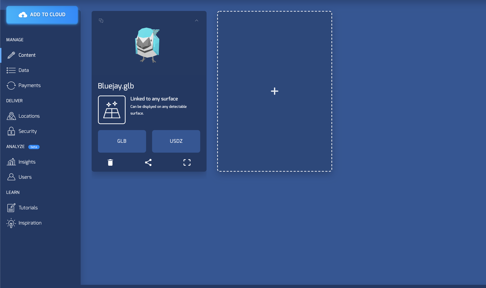

# Unity-ARFoundation-echoAR-Twitter-Demo
Twitter Demo for echoAR.  Type a hashtag search query - eg. #election2020 or #BlackLivesMatter - (with no spaces for now!) into search bar and hit search to spawn up to 15 local tweets containing the hashtag. 

## Register
Don't have an API key? Make sure to register for FREE at [echoAR](https://www.echoar.xyz/).


## Setup
### Twitter
1. Create a [Twitter account](www.twitter.com) if you don't have one already. This will allow you to access the Twitter developer site
2. Head to the [Twitter developer site](apps.twitter.com) and create a new application.
3. Fill out all the details and once you complete it you will recieve an **API Key** and an **API Secret Key** which will be used in the Unity app.

### Unity
1. Clone [echoAR-Twitter-Demo](https://github.com/echoARxyz/Unity-ARFoundation-echoAR) sample code.
2. Add and Open repo in Unity Hub as Unity 3D Project
3. Download [echoAR Unity SDK](https://bit.ly/echoARUnitySDKDownload) and import the package into the project
4. [Set the echoAR API key](https://docs.echoar.xyz/unity/using-the-sdk) in the echoAR.cs script inside the ```Assets/echoAR/echoAR.prefab``` using the the Inspector.
5. In ```Assets/echoAR/CustomBehaviour.cs```, comment out line 27 
```
this.gameObject.AddComponent<RemoteTransformations>().entry = entry;
```
and replace with:
```c#
// Set Rotation to parent
this.gameObject.transform.rotation = this.gameObject.transform.parent.transform.rotation;
// Set Scale
this.gameObject.transform.localScale = new Vector3(0.001f, 0.001f, 0.001f);
```
6. Open ```Assets/Scenes/Main```.
7. Click on the ```TweetManager``` game object in the heirarchy and in the ```Inspector > TweetManager(Script)``` add your Twitter **API Key** and **API Secret Key**.
8. In the ```TweetManager``` game object, in the ```Inspector > TweetGenerator(Script)``` 

   * Add ```Assets/Prefabs/TweetObject.Prefab``` to the ```Tweet Prefab``` field.
   * Add ```Assets/echoAR/echoAR.prefab``` to the ```Object To Spawn``` field.
   * Add ```ARCamera``` from the hierarchy to the ```Spawn Point``` field.

## Build & Run
[Build and run the AR application.](https://docs.echoar.xyz/unity/adding-ar-capabilities#4-build-and-run-the-ar-application) Verify that the ```Assets/Scenes/Main``` scene is ticked in the Scenes in Build list and click ```Build And Run```.

## Learn More
Refer to our [documentation](https://docs.echoar.xyz/unity/) to learn more about how to use Unity and echoAR.

## Support
Feel free to reach out at [support@echoAR.xyz](support@echoAR.xyz) or join our [support channel on Slack](https://join.slack.com/t/echoar/shared_invite/enQtNTg4NjI5NjM3OTc1LWU1M2M2MTNlNTM3NGY1YTUxYmY3ZDNjNTc3YjA5M2QyNGZiOTgzMjVmZWZmZmFjNGJjYTcxZjhhNzk3YjNhNjE).

## Screenshots

note: text under search bar will not appear in current build.


